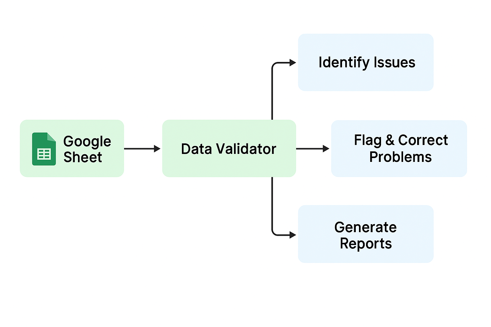

# db-check-cocaine-seizures
This is a lightweight database management strategy for monitoring entries by the IC team in the shared Google Sheet "incautaciones cocaina 01-02".

It is designed to support weekly governance workflows with:

📈 Monitoring tools for data quality

🔍 Custom validation rules

📊 KPI-based reporting

🚨 Alert for anomalies

🎛️ Quick filters for targeted analyses

✅ A script for direct edits on the Google Sheet

## Why?
The spreadsheet is where the data lives. It remains a collaborative work in progress, shaped by multiple investigators. This tool acts like a back-end and dedicated quality checkpoint:

- Helps us keep the data and process trustworthy

- Saves time

- Complements Google Sheets basic validation

- Facilitates team monitoring, analysis and reporting

### How does it work?

This tool is multifunctional and can be adapted according to the database's goal or to specific project tasks, following a create-read-update-delete logic. The script and associated material can be placed in IC's Github.

Apart from checking the overall "data health", there are three approaches to validation:

- Manage all the rules here and report
- Just verify and report 
- Hybrid

### Variables by theme:

| **Category**           | **Variables**                                                                                                                                             |
|------------------------|------------------------------------------------------------------------------------------------------------------------------------------------------------|
| <mark style="background-color: #90EE90">**Event Metadata**</mark>     | <mark style="background-color: #90EE90">Type, Time unit, Date, Date 2, Year, Month, Day, Duration, Description, Source link, Project interested</mark>                                                  |
| **Drugs & Quantities** | Type Drugs, Quantity, Weight unit, seizure_kgs                                                                                         |
| **Modus Operandi**     | Modus Operandi/place of seizure, Sub MO                                                                                                                   |
| **Seizure Location**   | Region, Country, Department/State, Municipality/Port                                                                                                      |
| **Origin**             | Origin country, Origin Area, Origin municipality                                                                                                          |
| **Transit**            | Transit 1/Region, Transit 1/country, Transit 1/Department, Transit 1/Municipality, Transit 2/ region, Transit 2/ country, Transit 2/Department, Transit 2/municipality/port |
| **Destination**        | Destition - Region, Destition - Country, Destition - department.state, Destition - Municipality/Port, Destition 2 - Country, Destition 2 - Municipality/Port |
| **Criminal Actors**    | Criminal group #1, Criminal group #2, Criminal group #3                                                                                                  |

### Walkthrough on how the API was set up
 _***Enabling the Google Sheets API and Creating a Service Account***_

To allow external programs (like Python or R scripts) to access the Google Sheet for validation and reporting:

1. **Go to the [Google Cloud Console](https://console.cloud.google.com/).**

2. **Create a new project** or select an existing one.

3. **Enable APIs**:
   - Navigate to **APIs & Services > Library**.
   - Search for **Google Sheets API** and click **Enable**.
   - Also enable **Google Drive API** (required for some file operations).

4. **Create a Service Account**:
   - Go to **APIs & Services > Credentials**.
   - Click **Create Credentials > Service Account**.
   - Provide a name (`db-watch`) and click **Create**.
   - Skip the permissions step, then click **Done**.

5. **Generate JSON Credentials**:
   - In the Service Accounts list, find your new account.
   - Click the three dots on the right → **Manage keys**.
   - Click **Add Key > Create New Key**.
   - Choose **JSON** format and download the file (Kept safe).

6. **Share Your Google Sheet with the Service Account**:
   - Open your Google Sheet.
   - Click **Share**.
   - Add the Service Account’s email address (db-watch@summer-sector-439022-v6.iam.gserviceaccount.com).
   - Give it **Editor** access.

